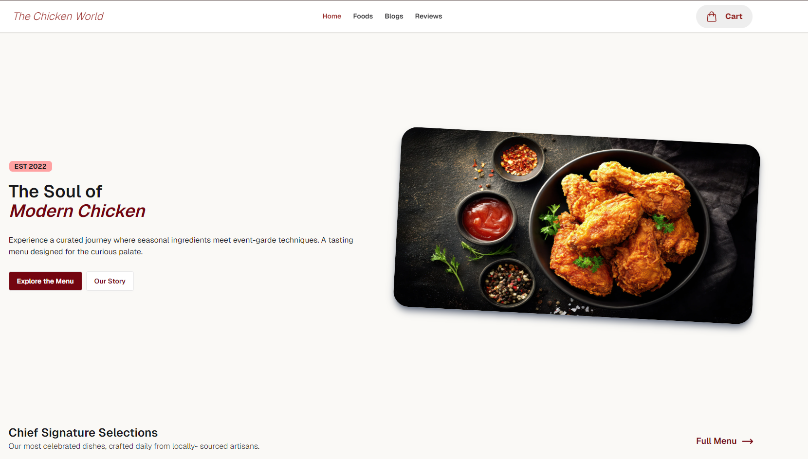

  

---

  

# 🍗 Chicken World – Premium Food Ordering E-commerce Website

🔗 Live Demo: https://chickenworld-next.vercel.app/

---

## 📌 About the Project

**Chicken World** is a modern food ordering e-commerce website built using **Next.js**.  
It provides a smooth user experience where users can browse food items, view detailed pages, and manage a dynamic cart system with quantity control.

This project focuses on building a **real-world e-commerce UI/UX experience** with clean design and scalable architecture.

---

## 🚀 Features

### 🍔 Food Ordering System

- Browse chicken food items with modern UI
- Dynamic food details page using Next.js routing
- Add items to cart system
- Prevent duplicate items in cart
- Quantity increase and decrease system (+ / -)
- Automatic item removal when quantity reaches 0

---

### 🛒 Cart System (Context API Based)

- Global state management using Context API
- Real-time cart updates across components
- Quantity-based cart logic instead of duplicates
- Add, increase, and decrease item functionality
- Clean and scalable state structure

---

### 📰 Blog Section

- Modern blog card UI with animations
- “Read More” navigation feature
- Custom **Not Found / Error page**
- Error page displayed when invalid blog routes are accessed
- Smooth hover and transition effects

---

### ⭐ Reviews Section

- 10+ customer review cards
- Star rating system
- Responsive grid layout
- Smooth Framer Motion animations
- Clean and modern UI design

---

### 🎨 UI / UX Features

- Fully responsive design (mobile-first approach)
- Sticky navigation bar
- Floating cart button UI
- Smooth hover effects and animations
- Modern food brand aesthetic design
- Tailwind CSS utility-first styling

---

## ⚙️ Tech Stack

- Next.js (App Router)
- React.js
- Tailwind CSS
- Context API
- Framer Motion
- DaisyUI (optional usage)

---

## 📁 Project Structure (Overview)

---

## 🧠 Key Functionalities Explained

### 🛒 Cart Logic

- Uses Context API for global state management
- Prevents duplicate items in cart
- Handles quantity increment and decrement
- Automatically removes item when quantity becomes zero

---

### ⚡ Dynamic Routing

- Food details page uses dynamic route (`/food/[id]`)
- Blog section uses navigation with error handling
- Custom error page improves UX

---

## ❌ Error Handling

- Custom **Not Found page** added
- Handles invalid blog routes gracefully
- Prevents broken navigation experience

---

## 🎯 What I Learned

- Advanced React state management (Context API)
- Real-world cart system logic
- Next.js App Router and dynamic routing
- UI/UX design for e-commerce systems
- Animation using Framer Motion
- Component-based architecture thinking

---

## 🔥 Future Improvements

- Authentication system (login/signup)
- Backend integration (MongoDB / Firebase)
- Admin dashboard for food management
- Payment gateway integration
- Real order tracking system
- User review submission system

---

## 🙌 Author

**Mohammad Hasib**  
Frontend Developer (React / Next.js)

---

## ⭐ Feedback

If you like this project, feel free to star it ⭐ and share your feedback!
